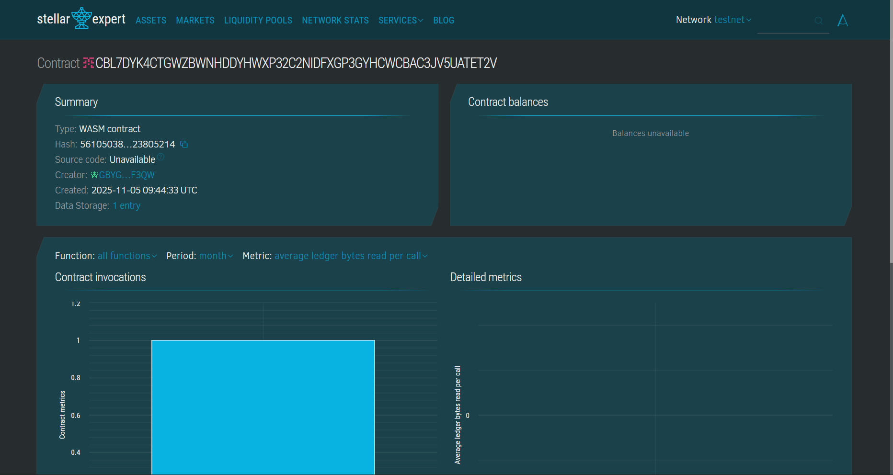
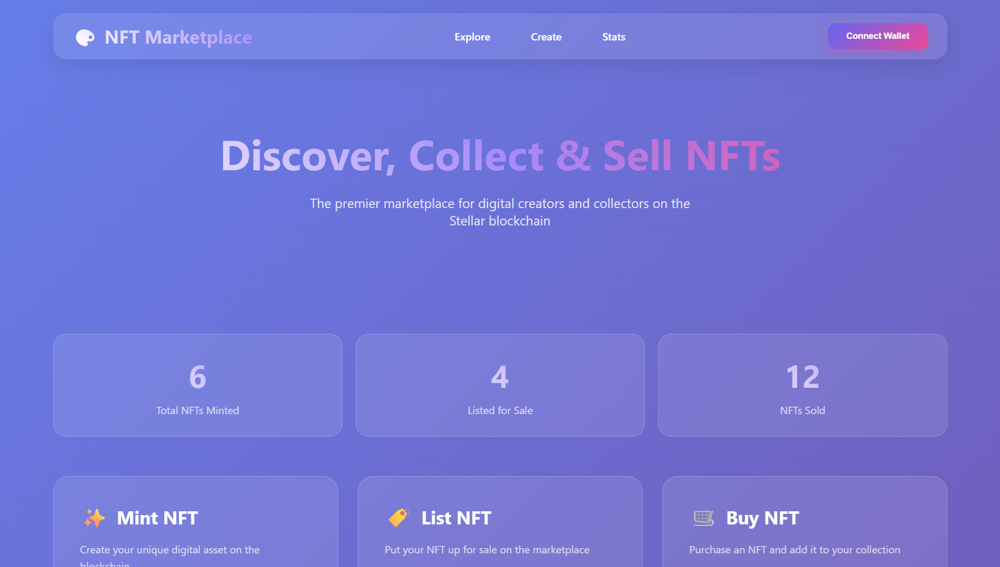
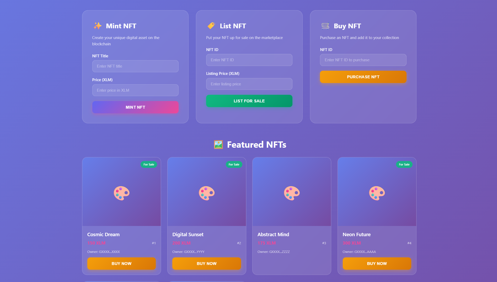

# NFT Marketplace

## Project Title

**NFT Marketplace Smart Contract**

## Project Description

The NFT Marketplace is a decentralized platform built on the Stellar blockchain using Soroban SDK that enables users to mint, buy, sell, and trade Non-Fungible Tokens (NFTs). This smart contract provides a secure and transparent marketplace where creators can mint their digital assets as NFTs and collectors can discover, purchase, and trade unique digital items. The platform ensures ownership verification, transparent pricing, and seamless transactions through blockchain technology.

## 🎯 Overview

The **NFT Marketplace** is a decentralized platform built on the Stellar blockchain using the Soroban SDK. It enables creators to mint their digital assets as NFTs and allows collectors to discover, purchase, and trade unique digital items. The platform ensures ownership verification, transparent pricing, and seamless blockchain transactions.

### Project Vision

> Democratize the NFT ecosystem by creating an accessible, user-friendly, and secure marketplace that empowers digital creators and collectors worldwide.

- 🎨 **Empower Creators**  Provide artists and content creators a platform to tokenize and monetize their digital work
- 🔒 **Build Trust** Leverage blockchain technology for transparent ownership records and secure transactions
- 🌐 **Foster Community**  Create a vibrant ecosystem where creators and collectors connect, trade, and collaborate
- ⚡ **Drive Innovation**  Continuously evolve the platform with cutting-edge blockchain features


## Project Vision

Our vision is to democratize the NFT ecosystem by creating an accessible, user-friendly, and secure marketplace that empowers digital creators and collectors worldwide. We aim to:

- **Empower Creators**: Provide artists, musicians, and content creators with a platform to tokenize and monetize their digital creations
- **Build Trust**: Leverage blockchain technology to ensure transparent ownership records and secure transactions
- **Foster Community**: Create a vibrant ecosystem where creators and collectors can connect, trade, and collaborate
- **Drive Innovation**: Continuously evolve the platform with cutting-edge features that enhance the NFT trading experience
- **Promote Accessibility**: Make NFT creation and trading simple and accessible to users of all technical backgrounds

## 📁 Project Structure

```
NFTMarketplace/
├── contracts/
│   └── hello-world/               # Soroban smart contract (Rust)
│       ├── src/
│       │   ├── lib.rs             # Main contract logic (mint, list, buy, stats)
│       │   └── test.rs            # Unit tests for contract functions
│       └── Cargo.toml             # Contract-level dependencies
│
├── frontend/                      # Frontend web application
│   ├── index.html                 # Main HTML entry point
│   ├── styles/                    # CSS styling files
│   └── scripts/                   # JavaScript for wallet + contract interaction
│
├── Cargo.toml                     # Root workspace Cargo config
├── Cargo.lock                     # Dependency lock file
├── contracts.code-workspace       # VS Code workspace settings
├── .gitignore                     # Git ignore rules
├── image.png                      # Contract deployment screenshot
├── frontend.png                   # Frontend UI screenshot
├── listing.png                    # NFT listing screenshot
└── README.md                      # Project documentation
```

## 🏗️ Architecture

### Technology Stack

| Layer | Technology |
|---|---|
| Blockchain | Stellar Testnet |
| Smart Contract | Rust (Soroban SDK) |
| Frontend | HTML, CSS, JavaScript |
| Authentication | Address-based ownership verification |
| Storage | On-chain decentralized storage |
| Build Tool | Cargo (Rust) |

### System Architecture

```
┌──────────────────────────────────────────────────────┐
│                    Frontend (HTML/JS)                 │
│         Wallet Connect · Mint · Buy · List UI        │
└───────────────────────┬──────────────────────────────┘
                        │  RPC Calls (Soroban CLI / SDK)
┌───────────────────────▼──────────────────────────────┐
│              Soroban Smart Contract (Rust)            │
│   mint_nft · list_nft · buy_nft · get_stats          │
└───────────────────────┬──────────────────────────────┘
                        │  Ledger Entries
┌───────────────────────▼──────────────────────────────┐
│             Stellar Blockchain (Testnet)              │
│   Immutable NFT Records · Ownership State · Txns     │
└──────────────────────────────────────────────────────┘
```
### Core Components

1. **Smart Contract (Soroban / Rust)**
   - Handles all on-chain NFT logic
   - Manages ownership, listing state, and sales
   - Functions: `mint_nft`, `list_nft`, `buy_nft`, `get_marketplace_stats`
   - Data stored: NFT ID, title, price, owner address, listing status

2. **Frontend Application (HTML/CSS/JS)**
   - Browser-based UI for interacting with the marketplace
   - Connects to Stellar wallet for signing transactions
   - Displays NFT listings, minting forms, and marketplace analytics

3. **Stellar Blockchain (Testnet)**
   - Provides the decentralized ledger for all NFT records
   - Ensures immutability of ownership and transaction history
   - All contract state is stored on-chain

---
### On-Chain Data Model

```rust
pub struct NFT {
    pub id: u64,
    pub title: String,
    pub owner: Address,
    pub price: u64,
    pub is_listed: bool,
}

pub struct MarketplaceStats {
    pub total_minted: u64,
    pub total_listed: u64,
    pub total_sold: u64,
}
```

---

## Key Features

### 1. **NFT Minting**

- Create unique NFTs with custom titles and pricing
- Automatic generation of unique NFT IDs
- Ownership verification and authentication
- Secure storage of NFT metadata on the blockchain

### 2. **NFT Listing**

- List owned NFTs for sale on the marketplace
- Set custom pricing for each NFT
- Owner-only listing control with authentication
- Prevent duplicate listings

### 3. **NFT Trading**

- Seamless buying and selling of listed NFTs
- Automatic ownership transfer upon purchase
- Buyer authentication and verification
- Real-time marketplace statistics

### 4. **Marketplace Analytics**

- Track total NFTs minted on the platform
- Monitor currently listed NFTs for sale
- View historical sales data
- Transparent marketplace statistics

### 5. **Security Features**

- Owner authentication for all critical operations
- Prevent unauthorized transfers and listings
- Built-in validation checks
- Immutable transaction records on blockchain

## Future Scope

### Short-term Enhancements (3-6 months)

- **Auction Functionality**: Implement time-bound auctions with bidding mechanisms
- **Royalty System**: Enable creators to earn royalties from secondary sales
- **NFT Collections**: Support for creating and managing NFT collections
- **Enhanced Metadata**: Store additional NFT attributes like images, descriptions, and properties

### Medium-term Development (6-12 months)

- **Multi-token Support**: Enable trading with various cryptocurrencies and tokens
- **Fractionalized NFTs**: Allow fractional ownership of high-value NFTs
- **Staking Mechanism**: Reward NFT holders for staking their assets
- **Cross-chain Bridge**: Enable NFT transfers across different blockchain networks
- **Advanced Search & Filters**: Implement sophisticated discovery and filtering options

### Long-term Vision (1-2 years)

- **DAO Governance**: Implement decentralized governance for platform decisions
- **Social Features**: Add profiles, following, commenting, and social engagement
- **Virtual Gallery**: Create immersive 3D galleries for NFT exhibitions
- **AI-powered Recommendations**: Personalized NFT recommendations based on user preferences
- **Mobile Application**: Native mobile apps for iOS and Android
- **Metaverse Integration**: Connect NFTs with virtual worlds and gaming platforms
- **Carbon Offset Program**: Implement eco-friendly initiatives to offset blockchain energy consumption

### Advanced Features

- **Lazy Minting**: Mint NFTs only when purchased to reduce gas fees
- **Batch Operations**: Support bulk minting and listing operations
- **Escrow Services**: Secure escrow for high-value transactions
- **Verification Badges**: Authenticate and verify prominent creators
- **Analytics Dashboard**: Comprehensive insights for traders and creators
- **API & SDK**: Developer tools for third-party integrations

---

## Technical Specifications

**Blockchain**: Stellar  
**Smart Contract Language**: Rust (Soroban SDK)  
**Storage**: On-chain decentralized storage  
**Authentication**: Address-based ownership verification

## Getting Started

### Prerequisites

- Rust programming language
- Soroban CLI
- Stellar account

### Installation

```bash
# Clone the repository
git clone <repository-url>

# Build the contract
soroban contract build

# Deploy to Stellar network
soroban contract deploy --wasm target/wasm32-unknown-unknown/release/nft_marketplace.wasm --network testnet
```

### Usage Examples

**Mint an NFT:**

```bash
soroban contract invoke \
  --id <CONTRACT_ID> \
  --fn mint_nft \
  --arg <OWNER_ADDRESS> \
  --arg "My First NFT" \
  --arg 1000
```

**List NFT for Sale:**

```bash
soroban contract invoke \
  --id <CONTRACT_ID> \
  --fn list_nft \
  --arg <SELLER_ADDRESS> \
  --arg <NFT_ID> \
  --arg 2000
```

**Buy an NFT:**

```bash
soroban contract invoke \
  --id <CONTRACT
```

## Contract details

Contract id: CBL7DYK4CTGWZBWNHDDYHWXP32C2NIDFXGP3GYHCWCBAC3JV5UATET2V


---

## 🔗 Contract Details

| Field | Value |
|---|---|
| Contract ID | `CBL7DYK4CTGWZBWNHDDYHWXP32C2NIDFXGP3GYHCWCBAC3JV5UATET2V` |
| Network | Stellar Testnet |
| Language | Rust (Soroban SDK) |
| Build Tool | Cargo |


---

### Frontend UI



---

## 📝 License

This project is open-source and available under the [MIT License](LICENSE).

## 👤 Author

Developed by [@anasdsce](https://github.com/anasdsce)

---

> **Built with ❤️ on the Stellar Blockchain using Soroban Smart Contracts**
